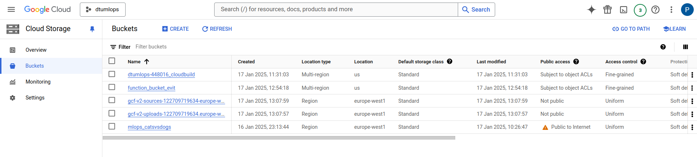
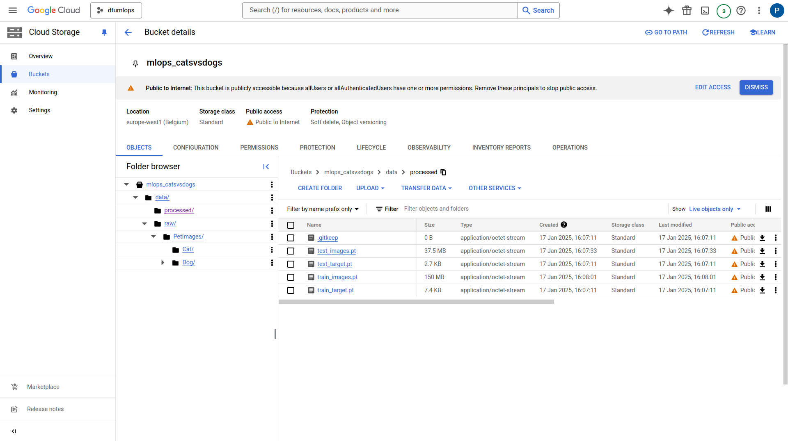
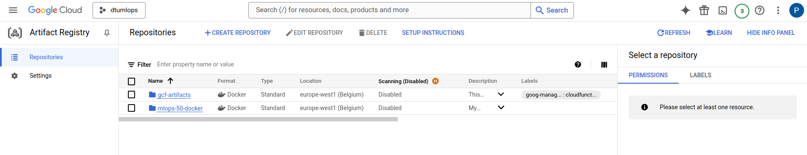
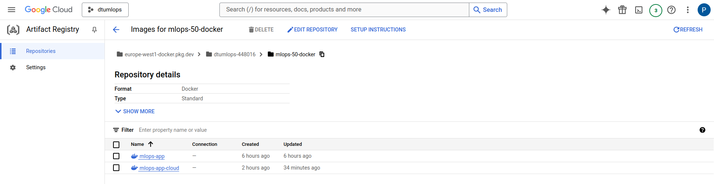
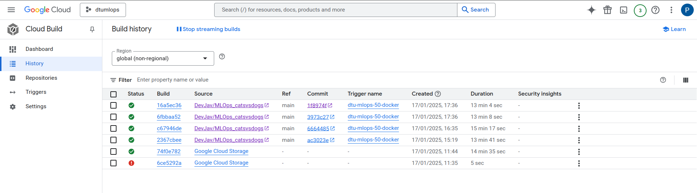
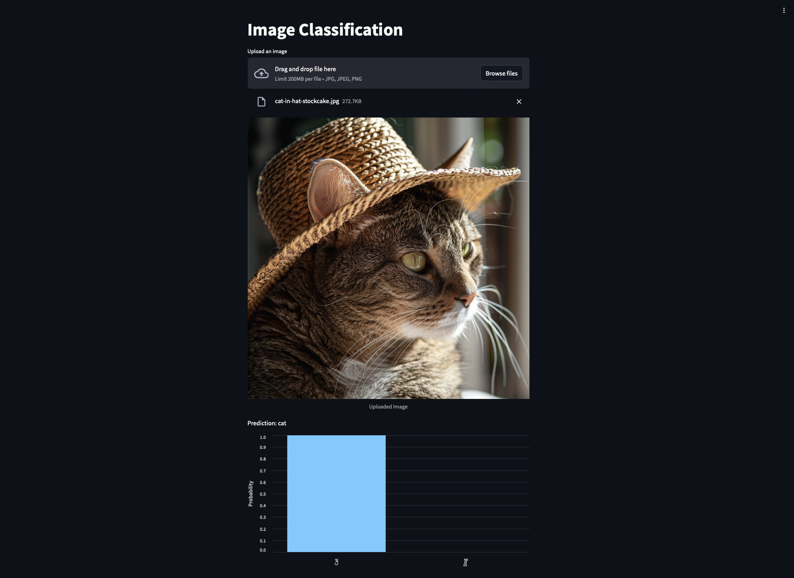

# Exam template for 02476 Machine Learning Operations

This is the report template for the exam. Please only remove the text formatted as with three dashes in front and behind
like:

```--- question 1 fill here ---```

Where you instead should add your answers. Any other changes may have unwanted consequences when your report is
auto-generated at the end of the course. For questions where you are asked to include images, start by adding the image
to the `figures` subfolder (please only use `.png`, `.jpg` or `.jpeg`) and then add the following code in your answer:

```markdown

```

In addition to this markdown file, we also provide the `report.py` script that provides two utility functions:

Running:

```bash
python report.py html
```

Will generate a `.html` page of your report. After the deadline for answering this template, we will auto-scrape
everything in this `reports` folder and then use this utility to generate a `.html` page that will be your serve
as your final hand-in.

Running

```bash
python report.py check
```

Will check your answers in this template against the constraints listed for each question e.g. is your answer too
short, too long, or have you included an image when asked. For both functions to work you mustn't rename anything.
The script has two dependencies that can be installed with

```bash
pip install typer markdown
```

## Overall project checklist

The checklist is *exhaustive* which means that it includes everything that you could do on the project included in the
curriculum in this course. Therefore, we do not expect at all that you have checked all boxes at the end of the project.
The parenthesis at the end indicates what module the bullet point is related to. Please be honest in your answers, we
will check the repositories and the code to verify your answers.

### Week 1

* [x] Create a git repository (M5)
* [x] Make sure that all team members have write access to the GitHub repository (M5)
* [x] Create a dedicated environment for you project to keep track of your packages (M2)
* [x] Create the initial file structure using cookiecutter with an appropriate template (M6)
* [x] Fill out the `data.py` file such that it downloads whatever data you need and preprocesses it (if necessary) (M6)
* [x] Add a model to `model.py` and a training procedure to `train.py` and get that running (M6)
* [x] Remember to fill out the `requirements.txt` and `requirements_dev.txt` file with whatever dependencies that you
    are using (M2+M6)
* [x] Remember to comply with good coding practices (`pep8`) while doing the project (M7)
* [x] Do a bit of code typing and remember to document essential parts of your code (M7)
* [ ] Setup version control for your data or part of your data (M8)
* [ ] Add command line interfaces and project commands to your code where it makes sense (M9)
* [x] Construct one or multiple docker files for your code (M10)
* [x] Build the docker files locally and make sure they work as intended (M10)
* [x] Write one or multiple configurations files for your experiments (M11)
* [x] Used Hydra to load the configurations and manage your hyperparameters (M11)
* [ ] Use profiling to optimize your code (M12)
* [x] Use logging to log important events in your code (M14)
* [x] Use Weights & Biases to log training progress and other important metrics/artifacts in your code (M14)
* [ ] Consider running a hyperparameter optimization sweep (M14)
* [x] Use PyTorch-lightning (if applicable) to reduce the amount of boilerplate in your code (M15)

### Week 2

* [x] Write unit tests related to the data part of your code (M16)
* [x] Write unit tests related to model construction and or model training (M16)
* [x] Calculate the code coverage (M16)
* [x] Get some continuous integration running on the GitHub repository (M17)
* [x] Add caching and multi-os/python/pytorch testing to your continuous integration (M17)
* [x] Add a linting step to your continuous integration (M17)
* [x] Add pre-commit hooks to your version control setup (M18)
* [ ] Add a continues workflow that triggers when data changes (M19)
* [ ] Add a continues workflow that triggers when changes to the model registry is made (M19)
* [x] Create a data storage in GCP Bucket for your data and link this with your data version control setup (M21)
* [x] Create a trigger workflow for automatically building your docker images (M21)
* [x] Get your model training in GCP using either the Engine or Vertex AI (M21)
* [x] Create a FastAPI application that can do inference using your model (M22)
* [x] Deploy your model in GCP using either Functions or Run as the backend (M23)
* [ ] Write API tests for your application and setup continues integration for these (M24)
* [x] Load test your application (M24)
* [ ] Create a more specialized ML-deployment API using either ONNX or BentoML, or both (M25)
* [x] Create a frontend for your API (M26)

### Week 3

* [ ] Check how robust your model is towards data drifting (M27)
* [ ] Deploy to the cloud a drift detection API (M27)
* [ ] Instrument your API with a couple of system metrics (M28)
* [x] Setup cloud monitoring of your instrumented application (M28)
* [x] Create one or more alert systems in GCP to alert you if your app is not behaving correctly (M28)
* [ ] If applicable, optimize the performance of your data loading using distributed data loading (M29)
* [ ] If applicable, optimize the performance of your training pipeline by using distributed training (M30)
* [ ] Play around with quantization, compilation and pruning for you trained models to increase inference speed (M31)

### Extra

* [ ] Write some documentation for your application (M32)
* [ ] Publish the documentation to GitHub Pages (M32)
* [ ] Revisit your initial project description. Did the project turn out as you wanted?
* [ ] Create an architectural diagram over your MLOps pipeline
* [ ] Make sure all group members have an understanding about all parts of the project
* [ ] Uploaded all your code to GitHub

## Group information

### Question 1
> **Enter the group number you signed up on <learn.inside.dtu.dk>**
>
> Answer:

50

### Question 2
> **Enter the study number for each member in the group**
>
> Example:
>
> *sXXXXXX, sXXXXXX, sXXXXXX*
>
> Answer:

s233671, s233670, s232425, s242577, s180866

### Question 3
> **A requirement to the project is that you include a third-party package not covered in the course. What framework**
> **did you choose to work with and did it help you complete the project?**
>
> Recommended answer length: 100-200 words.
>
> Example:
> *We used the third-party framework ... in our project. We used functionality ... and functionality ... from the*
> *package to do ... and ... in our project*.
>
> Answer:

We used the third-party framework PyTorch Image Models (TIMM) in our project, as our goal was to classify images, and this framework is well-suited for that purpose. We mainly used the package to load pre-trained models, focusing on the MobileNetV3 model because it is lightweight and suitable for team members without access to a GPU, and to fine-tune it on our dataset. The package allowed us to quickly start with a state-of-the-art model, saving us the time of building it from scratch and achieving better results than training from scratch, thanks to the pretraining.

In the beggining, as we were unsure on what we were going to learn, we selected this lightweight model. Then after learning how to use cloud services, we could have used a more complex model also from TIMM. However, as the results were good, we decided to keep the model as it was, as it was not the main focus of the project.

## Coding environment

> In the following section we are interested in learning more about you local development environment. This includes
> how you managed dependencies, the structure of your code and how you managed code quality.

### Question 4

> **Explain how you managed dependencies in your project? Explain the process a new team member would have to go**
> **through to get an exact copy of your environment.**
>
> Recommended answer length: 100-200 words
>
> Example:
> *We used ... for managing our dependencies. The list of dependencies was auto-generated using ... . To get a*
> *complete copy of our development environment, one would have to run the following commands*
>
> Answer:

We manage our dependencies using `requirements.txt` and `requirements-dev.txt`, which were autogenerated with `pipreqs`. To set up the environment, new team members should begin by cloning the repository. Next, they should create a new environment and install `pip`. Then, they can use `pip` to install all packages listed in both `requirements.txt` and `requirements-dev.txt`. If the `invoke` package is installed, running the commands `invoke requirements` or `invoke dev-requirements` will also install the necessary dependencies. Finally, to access the data, team members should either clone the dataset using DVC (Data Version Control) or execute `invoke preprocess-data` to download and prepare the data for use.

### Question 5

> **We expect that you initialized your project using the cookiecutter template. Explain the overall structure of your**
> **code. What did you fill out? Did you deviate from the template in some way?**
>
> Recommended answer length: 100-200 words
>
> Example:
> *From the cookiecutter template we have filled out the ... , ... and ... folder. We have removed the ... folder*
> *because we did not use any ... in our project. We have added an ... folder that contains ... for running our*
> *experiments.*
>
> Answer:

We started with a Cookiecutter template and customized it for our project. Here's a breakdown of the adjustments:

- **Dependencies:** We populated the `requirements.txt` and `pyproject.toml` files with the necessary dependencies.
- **Configuration files:** We updated `.gitignore`, `.pre-commit-config.yaml`, and other configuration files to fit the project needs.
- **Project structure:**
  - The `tests` and `src/catsvsdogs` directories were filled with the relevant code and tests.
  - We stored the trained models in the `models` directory and the logs in the `logs` directory.
  - Dependency files were placed in the `dependency` folder.
  - The `dockerfiles` and `data` directories were also filled accordingly.

We removed the `notebooks` folder as we did not use any notebooks in this project. For specific utilities, we included the `wandb` folder for Weights & Biases and folders for outputs from Hydra.

### Question 6

> **Did you implement any rules for code quality and format? What about typing and documentation? Additionally,**
> **explain with your own words why these concepts matters in larger projects.**
>
> Recommended answer length: 100-200 words.
>
> Example:
> *We used ... for linting and ... for formatting. We also used ... for typing and ... for documentation. These*
> *concepts are important in larger projects because ... . For example, typing ...*
>
> Answer:

At first, we used Ruff to maintain good code styling. We implemented a two-step check process. First, as described in the README.md file, we ensure that all Ruff checks pass before pushing code to GitHub. Second, we set up automatic GitHub checks that verify the pushed code adheres to the Ruff requirements. We also used pre-commit. However, as there were some inconsistencies between the code formatters when running locally and on GitHub, we decided to use [pre-commit ci](https://pre-commit.ci/), which is a bot that automatically fixes the code formatting and pushes the changes back to the repository.

In larger projects, having a tidy and consistent code is very important. Since many people may work on the same code, having a unified coding style makes the code easier to read and understand. Without a consistent style, the code can become messy and difficult to understand. Additionally, tidy code can help new team members quickly understand the structure.

## Version control

> In the following section we are interested in how version control was used in your project during development to
> corporate and increase the quality of your code.

### Question 7

> **How many tests did you implement and what are they testing in your code?**
>
> Recommended answer length: 50-100 words.
>
> Example:
> *In total we have implemented X tests. Primarily we are testing ... and ... as these the most critical parts of our*
> *application but also ... .*
>
> Answer:

We implemented three test-files with four different test functions. Two of the tests are parameterised which tests a wide array of parameters, and most test functions include multiple assert statements. In total 16 tests are run. We primarel test the model pipeline, which includes checks if data is of the correct type, and that the model input and outputs are the correct shape, size and type. To run the unittests on github, we check if the data path exists, and if not, we skip the data tests. Most often the unittests on github therefore contain 15 tests and 1 skipped.

### Question 8

> **What is the total code coverage (in percentage) of your code? If your code had a code coverage of 100% (or close**
> **to), would you still trust it to be error free? Explain you reasoning.**
>
> Recommended answer length: 100-200 words.
>
> Example:
> *The total code coverage of code is X%, which includes all our source code. We are far from 100% coverage of our **
> *code and even if we were then...*
>
> Answer:

The code coverage is rapported with each unittest on github actions, and is at 37% on the data.py, model.py and train.py. This is far from extensive, and could be expanded. However we focused mainly on the model, as this is the core part of the code, and has a coverage of 65%. We would like to test a larger part of the code, but even if we reached 100% coverage, we would not be certain of having no errors. We would rather test the core funtionalities that are nessecary for a successfull run, which is the pipeline from data input to estimation.

An example of the test and coverage output is seen here:
```
============================= test session starts ==============================
platform darwin -- Python 3.12.8, pytest-7.4.3, pluggy-1.5.0
rootdir: /Users/runner/work/MLOps_catsvsdogs/MLOps_catsvsdogs
plugins: hydra-core-1.3.2
collected 16 items

tests/test_data.py s                                                     [  6%]
tests/test_model.py ........                                             [ 56%]
tests/test_train.py .......                                              [100%]

======================== 15 passed, 1 skipped in 29.38s ========================
Name                         Stmts   Miss  Cover   Missing
----------------------------------------------------------
src/catsvsdogs/__init__.py       0      0   100%
src/catsvsdogs/data.py          85     61    28%   22, 27-77, 81-82, 86-94, 99-103, 111-119, 124-127, 131
src/catsvsdogs/model.py         40     14    65%   31-39, 42, 45, 50-53, 57
src/catsvsdogs/train.py         61     42    31%   29-49, 55-101, 105
----------------------------------------------------------
TOTAL                          186    117    37%
```


### Question 9

> **Did you workflow include using branches and pull requests? If yes, explain how. If not, explain how branches and**
> **pull request can help improve version control.**
>
> Recommended answer length: 100-200 words.
>
> Example:
> *We made use of both branches and PRs in our project. In our group, each member had an branch that they worked on in*
> *addition to the main branch. To merge code we ...*
>
> Answer:

Yes, we used branches and pull requests as part of our workflow. Initially, we experienced a major issue when a direct push to the main branch with big files resulted in the repository being completely disrupted. This taught us the importance of using branches and pull requests for maintaining stability. We had to use tools like git-filter-repo to completely remove the large files from the repository, which was a time-consuming process due to our inexperience.

To prevent such incidents in the future, we set up the repository to only allow pull requests to the main branch. Additionally, we enforced a rule to prevent anyone from approving their own pull requests, ensuring peer review before merging. Each team member worked on their respective feature branches and submitted pull requests once their code was ready. This process allowed us to catch bugs, maintain code quality, and ensure that new changes integrated smoothly without impacting the main branch.

By implementing this structure, we improved collaboration and safeguarded the integrity of our codebase, ensuring a smoother and more professional development workflow.

### Question 10

> **Did you use DVC for managing data in your project? If yes, then how did it improve your project to have version**
> **control of your data. If no, explain a case where it would be beneficial to have version control of your data.**
>
> Recommended answer length: 100-200 words.
>
> Example:
> *We did make use of DVC in the following way: ... . In the end it helped us in ... for controlling ... part of our*
> *pipeline*
>
> Answer:

We did make use of DVC in the following way: we set it up with Google Cloud Buckets as our remote storage for data. However, since our dataset was fixed from the beginning and did not change during the project, we did not rely heavily on the versioning capabilities provided by DVC.

In the end, it helped us in tracking scenarios where our processed data would change. This occurred primarily when re-processing the dataset to adjust parameters such as batch size or image size, for instance, to optimize model training or improve performance. By using DVC, we ensured that each version of our processed data was stored and linked to its corresponding configurations, allowing us to easily revert to previous versions or test alternative setups without manually managing multiple copies of the processed data.

### Question 11

> **Discuss you continuous integration setup. What kind of continuous integration are you running (unittesting,**
> **linting, etc.)? Do you test multiple operating systems, Python  version etc. Do you make use of caching? Feel free**
> **to insert a link to one of your GitHub actions workflow.**
>
> Recommended answer length: 200-300 words.
>
> Example:
> *We have organized our continuous integration into 3 separate files: one for doing ..., one for running ... testing*
> *and one for running ... . In particular for our ..., we used ... .An example of a triggered workflow can be seen*
> *here: <weblink>*
>
> Answer:

Our project includes continuous integration (CI) workflows to ensure code consistency across different platforms. We run unit tests on Windows, Ubuntu, and MacOS to verify functionality on various operating systems. While these tests are not required for merging PRs, we try to ensure they pass. To optimize test performance, we added caching for shared dependencies, which significantly reduced runtime.

For code formatting, we initially set up a workflow on GitHub to run `ruff check .` and `ruff format .` without making changes to the code. Later, we added a pre-commit workflow to automatically fix formatting issues. However, as mentioned before, inconsistencies appeared between local formatting and GitHub results, even when using identical versions. To resolve this, we integrated [pre-commit.ci](https://pre-commit.ci/), a bot that fixes formatting issues and pushes updates directly to the repository. A sample commit from the pre-commit bot is available [here](https://github.com/DevJav/MLOps_catsvsdogs/pull/39/commits/b97ded1a16a1d4d31e08c5c228341f098b714f2d). This was a nice addition as this way the developer does not have to worry about the formatting, and can focus on the code.

After adding cloud functions, Google Cloud automatically also added a check that make sure that the different dockerfiles are built correctly. This way we ensure no changes have effect on the deployed version of the code.

## Running code and tracking experiments

> In the following section we are interested in learning more about the experimental setup for running your code and
> especially the reproducibility of your experiments.

### Question 12

> **How did you configure experiments? Did you make use of config files? Explain with coding examples of how you would**
> **run a experiment.**
>
> Recommended answer length: 50-100 words.
>
> Example:
> *We used a simple argparser, that worked in the following way: Python  my_script.py --lr 1e-3 --batch_size 25*
>
> Answer:

We initially used Typer for configuring experiments, which allowed us to pass arguments directly through the command line. However, as our project grew in complexity, we transitioned to Hydra to manage all configuration files effectively. Using Hydra, we created separate configuration files for data, model, training, and evaluation. This modular setup made it easy to experiment with different configurations without modifying the code. Another benefit of using Hydra was the ability to log each configuration for each experiment, ensuring reproducibility and making it easy to track the results of each run.

### Question 13

> **Reproducibility of experiments are important. Related to the last question, how did you secure that no information**
> **is lost when running experiments and that your experiments are reproducible?**
>
> Recommended answer length: 100-200 words.
>
> Example:
> *We made use of config files. Whenever an experiment is run the following happens: ... . To reproduce an experiment*
> *one would have to do ...*
>
> Answer:

As mentioned in Question 12, we used Hydra to manage all configuration files for our experiments, including those for data, model, training, and evaluation. One of the key benefits of using Hydra is that it automatically saves the configuration used for each run in a separate directory, ensuring that no information is lost.

Whenever an experiment is run, the exact configuration of all parameters is stored alongside the results, making it easy to track the setup that produced a particular outcome. To reproduce an experiment, we simply reuse the saved configuration file from a previous run. This feature allowed us to maintain a comprehensive record of every experiment and ensured reproducibility across the team.

### Question 14

> **Upload 1 to 3 screenshots that show the experiments that you have done in W&B (or another experiment tracking**
> **service of your choice). This may include loss graphs, logged images, hyperparameter sweeps etc. You can take**
> **inspiration from [this figure](figures/wandb.png). Explain what metrics you are tracking and why they are**
> **important.**
>
> Recommended answer length: 200-300 words + 1 to 3 screenshots.
>
> Example:
> *As seen in the first image when have tracked ... and ... which both inform us about ... in our experiments.*
> *As seen in the second image we are also tracking ... and ...*
>
> Answer:

As seen in the first image, we tracked **training loss** and **training accuracy**, which are critical metrics for evaluating the performance of our model during the training process.


The training loss shows a downward trend, indicating that the model is learning effectively. However, the fluctuations suggest that further tuning of hyperparameters such as the learning rate may be beneficial. The accuracy graph shows a steep increase early in training and eventually stabilizes around 99%, which suggests the model is fitting well to the training data. Tracking these metrics helps ensure that the model is neither overfitting nor underfitting, and adjustments can be made accordingly to achieve optimal generalization.

The second image provides a **confusion matrix**, which gives deeper insights into the model’s classification performance.


The confusion matrix indicates that the model correctly classified 957 cat images and 980 dog images, with minimal misclassifications of 55 cats as dogs and 8 dogs as cats. This analysis is valuable for understanding class-specific performance and identifying any biases or recurring patterns in the errors.

Tracking these key metrics is crucial for evaluating model performance, diagnosing potential issues, and guiding improvements in future iterations. By leveraging these insights, we can make data-driven decisions to refine our training pipeline, ensuring robust and reliable model performance in deployment scenarios.


### Question 15

> **Docker is an important tool for creating containerized applications. Explain how you used docker in your**
> **experiments/project? Include how you would run your docker images and include a link to one of your docker files.**
>
> Recommended answer length: 100-200 words.
>
> Example:
> *For our project we developed several images: one for training, inference and deployment. For example to run the*
> *training docker image: `docker run trainer:latest lr=1e-3 batch_size=64`. Link to docker file: <weblink>*
>
> Answer:

Yes, we created a Dockerfile for training, leveraging data stored in our Google Cloud Bucket. The Dockerfile is available at: [europe-west1-docker.pkg.dev/dtumlops-448016/mlops-50-docker/mlops-app-cloud](europe-west1-docker.pkg.dev/dtumlops-448016/mlops-50-docker/mlops-app-cloud).

To run the training image, we used the following commands. This will build the image and run the training pipeline:

```bash
docker build -f train.dockerfile . -t train:latest
docker run -it --rm --gpus all train
```

Additionally, interactive mode was possible using:

```bash
docker run -it --rm --gpus all train /bin/bash
```

To deploy the API interface, we also created a Dockerfile. This consisted in taking the `api.py` file and wrapping it into a container. It loads the latest model and starts the FastAPI server. After that, to have a nice frontend to use the API, we also created a Dockerfile for the frontend.

### Question 16

> **When running into bugs while trying to run your experiments, how did you perform debugging? Additionally, did you**
> **try to profile your code or do you think it is already perfect?**
>
> Recommended answer length: 100-200 words.
>
> Example:
> *Debugging method was dependent on group member. Some just used ... and others used ... . We did a single profiling*
> *run of our main code at some point that showed ...*
>
> Answer:

We didn’t settle on a standard debugging method, but because of our inexperience, we often relied on print statements to debug our code. We also used the VSCode debugger, which is a really straightforward and visual way to debug, as it lets you see all the variables and their current values at the moment of a breakpoint.

A worse experience was when things failed during cloud deployment. Navigating the logs there was much harder, with weird formatting that made it difficult to figure out what was happening. We would’ve liked a better way to debug cloud deployments, but we didn’t have the time to set that up.

## Working in the cloud

> In the following section we would like to know more about your experience when developing in the cloud.

### Question 17

> **List all the GCP services that you made use of in your project and shortly explain what each service does?**
>
> Recommended answer length: 50-200 words.
>
> Example:
> *We used the following two services: Engine and Bucket. Engine is used for... and Bucket is used for...*
>
> Answer:

We used the following GCP services in our project:

- **Google Cloud Buckets:** Used for storing our datasets and processed data. The buckets served as a remote storage solution, ensuring easy accessibility and integration with our version control system, DVC.

- **VM Instances (Compute Engine):** Utilized for running experiments and training our models in the cloud. These virtual machines provided the computational resources needed for efficient execution of our workloads.

- **Cloud Build:** Employed to build Docker images automatically. We set up triggers linked to our GitHub repository so that whenever changes were pushed, the Docker images were rebuilt and deployed. This streamlined our workflow and ensured that the latest code was always reflected in the containerized environment.

- **Vertex AI:** Used for orchestrating our model training and deployment pipelines. Vertex AI provided a managed environment for training models on distributed hardware and for deploying our trained models as scalable, reliable endpoints.

These services combined allowed us to manage data, compute resources, and deployment workflows efficiently, significantly improving our project’s scalability and reliability.

### Question 18

> **The backbone of GCP is the Compute engine. Explained how you made use of this service and what type of VMs**
> **you used?**
>
> Recommended answer length: 100-200 words.
>
> Example:
> *We used the compute engine to run our ... . We used instances with the following hardware: ... and we started the*
> *using a custom container: ...*
>
> Answer:

We used Compute Engine for training and experiments, initially deploying a **T4 GPU instance** in the South America region due to GPU unavailability in Europe. The instance was created using the following command:

```bash
gcloud compute instances create mlops-t4-gpu \
    --zone=southamerica-east1-c \
    --machine-type=n1-standard-1 \
    --image-family=tf2-ent-latest-gpu \
    --image-project=deeplearning-platform-release \
    --accelerator="type=nvidia-tesla-t4,count=1" \
    --maintenance-policy=TERMINATE \
    --metadata="install-nvidia-driver=True"
```

Although lag was significant while working on this instance, we managed to run our experiments and training pipelines successfully. Additionally, we used **Docker images** to containerize our training environment. These images were built using **Cloud Build**, with triggers linked to our GitHub repository to ensure that changes in the codebase were automatically reflected in the containerized environment. This approach allowed us to maintain consistency between our local and cloud environments, facilitating reproducibility and scalability across different stages of the project.


### Question 19

> **Insert 1-2 images of your GCP bucket, such that we can see what data you have stored in it.**
> **You can take inspiration from [this figure](figures/bucket.png).**
>
> Answer:





### Question 20

> **Upload 1-2 images of your GCP artifact registry, such that we can see the different docker images that you have**
> **stored. You can take inspiration from [this figure](figures/registry.png).**
>
> Answer:





### Question 21

> **Upload 1-2 images of your GCP cloud build history, so we can see the history of the images that have been build in**
> **your project. You can take inspiration from [this figure](figures/build.png).**
>
> Answer:




### Question 22

> **Did you manage to train your model in the cloud using either the Engine or Vertex AI? If yes, explain how you did**
> **it. If not, describe why.**
>
> Recommended answer length: 100-200 words.
>
> Example:
> *We managed to train our model in the cloud using the Engine. We did this by ... . The reason we choose the Engine*
> *was because ...*
>
> Answer:

Yes, we managed to train our model in the cloud using **Vertex AI**. We executed the training job using the following command:

```bash
gcloud ai custom-jobs create \
    --region=europe-west2 \
    --display-name=test-run \
    --config=config.yaml
```

The training process took almost 5 hours to complete due to the fact that we utilized only a CPU instance, as GPU-backed Vertex AI instances encountered persistent configuration errors. Despite this limitation, the managed infrastructure provided by Vertex AI ensured a seamless execution of the training pipeline.

Once the training was completed, the trained model was automatically uploaded to Google Cloud Buckets for storage and to Weights & Biases (W&B) as an artifact for experiment tracking and reproducibility. This setup allowed us to efficiently manage and retrieve the trained model for further evaluation and deployment.


## Deployment

### Question 23

> **Did you manage to write an API for your model? If yes, explain how you did it and if you did anything special. If**
> **not, explain how you would do it.**
>
> Recommended answer length: 100-200 words.
>
> Example:
> *We did manage to write an API for our model. We used FastAPI to do this. We did this by ... . We also added ...*
> *to the API to make it more ...*
>
> Answer:

We managed to write an API for our model using FastAPI. Since the goal of our model is to identify whether a provided image is of a cat or a dog, we implemented an endpoint to handle these requests. We started with the code from module M22, which explains similar functionality, and adapted it to load our latest model.

We created the `/predict` endpoint, which accepts a POST request with a file and returns the model's prediction. The response also includes additional information, such as the probability of the prediction and the class names. Thanks to uvicorn, the `/docs` endpoint is available, making it simple to upload an image and test the API interactively.

### Question 24

> **Did you manage to deploy your API, either in locally or cloud? If not, describe why. If yes, describe how and**
> **preferably how you invoke your deployed service?**
>
> Recommended answer length: 100-200 words.
>
> Example:
> *For deployment we wrapped our model into application using ... . We first tried locally serving the model, which*
> *worked. Afterwards we deployed it in the cloud, using ... . To invoke the service an user would call*
> *`curl -X POST -F "file=@file.json"<weburl>`*
>
> Answer:

To deploy our API, we initially tried using a Cloud Run function, which worked. However, this approach had some downsides: there was no version control, and any modifications required accessing Google Cloud through the web interface. To address these issues, we decided to adapt the `api.py` file from the template to create the API and then modified the `api.dockerfile` to build a container.

We successfully deployed the container to Google Cloud Run, configuring it to automatically build the image each time we push to the main branch. This solution is much better as it incorporates version control and automates the build process.

A request can be made like this:

```bash
 curl -X 'POST' \
  'https://mlops-catsvsdogs-122709719634.us-central1.run.app/predict' \
  -H 'accept: application/json' \
  -H 'Content-Type: multipart/form-data' \
  -F 'data=@{image}.jpg;type=image/jpg'
```

### Question 25

> **Did you perform any unit testing and load testing of your API? If yes, explain how you did it and what results for**
> **the load testing did you get. If not, explain how you would do it.**
>
> Recommended answer length: 100-200 words.
>
> Example:
> *For unit testing we used ... and for load testing we used ... . The results of the load testing showed that ...*
> *before the service crashed.*
>
> Answer:

# TODO: add unit testing

Below are the results of the load testing we performed on our API deployed on Google Cloud Run:

| **Metric**             | **Value**                |
|-------------------------|--------------------------|
| **Request Count**       | 562                      |
| **Median Response Time**| 820 ms                   |
| **Average Response Time**| 3593.86 ms              |
| **Min Response Time**   | 73.58 ms                 |
| **Max Response Time**   | 22910 ms (~23 seconds)   |

We used Locust to perform the load testing, simulating 50 users with a hatch rate of 10 users per second. The results showed that the API could handle a moderate load, with a median response time of 820 ms and an average response time of 3593.86 ms. However, this last metric was skewed by a few requests that took up to 23 seconds to complete.

One limitation was that multiple simultaneous requests resulted in running out of the limited memory that the Cloud Run had available, causing the service to crash and restart.

### Question 26

> **Did you manage to implement monitoring of your deployed model? If yes, explain how it works. If not, explain how**
> **monitoring would help the longevity of your application.**
>
> Recommended answer length: 100-200 words.
>
> Example:
> *We did not manage to implement monitoring. We would like to have monitoring implemented such that over time we could*
> *measure ... and ... that would inform us about this ... behaviour of our application.*
>
> Answer:

We attempted to implement monitoring for our API using Prometheus, following the guidelines provided in module M28. Unfortunately, we faced some challenges during the setup process and were unable to complete the implementation due to time constraints. The plan was to monitor key performance metrics such as response time, request count, and error rate, which would have given us valuable insights into potential issues and areas for optimization. While we couldn’t fully achieve this, we did have access to metrics and alerts from the Google cloud environment. Although not as detailed or effective as Prometheus, it still provided us with some level of monitoring to keep track of the service's performance.

## Overall discussion of project

> In the following section we would like you to think about the general structure of your project.

### Question 27

> **How many credits did you end up using during the project and what service was most expensive? In general what do**
> **you think about working in the cloud?**
>
> Recommended answer length: 100-200 words.
>
> Example:
> *Group member 1 used ..., Group member 2 used ..., in total ... credits was spend during development. The service*
> *costing the most was ... due to ... . Working in the cloud was ...*
>
> Answer:

All team members used the same cloud project, sharing the available credits. We spent **$14.66**, with the most expensive service being **Compute Engine**, which cost **$9.73** due to running GPU instances for training. Other significant costs came from **Artifact Registry ($3.50)** and **Vertex AI ($0.89)**, which were used for model storage and training.

Working in the cloud had a learning curve. Initially, we faced challenges with user permissions and accessing different services, which slowed us down. Setting up roles and ensuring the correct permissions for each team member took some time. However, once we resolved these issues, things went smoothly, and deployment became more efficient.

Overall, the cloud provided flexibility and scalability, allowing us to experiment with different configurations without hardware limitations. At the beginning we were a bit worried about overspending, but in the end we realised we could have probably used more demanding and thus expensive services, as the costs were quite low for the project.

Additionally, for the CI with GitHub actions, we used far more than the 2.000 compute minutes available (>4.000 minutes) for private repositories. As this is a public repository, there is no limit, which is also why we were not worried about this.


### Question 28

> **Did you implement anything extra in your project that is not covered by other questions? Maybe you implemented**
> **a frontend for your API, use extra version control features, a drift detection service, a kubernetes cluster etc.**
> **If yes, explain what you did and why.**
>
> Recommended answer length: 0-200 words.
>
> Example:
> *We implemented a frontend for our API. We did this because we wanted to show the user ... . The frontend was*
> *implemented using ...*
>
> Answer:

We implemented a frontend based on streamlit for the prediction API. We believe it wraps the project very nicely, as the frontend of this type of model closely resembles how a user would use it in the real world. The frontend is part of the continuous development, and is deployed on Cloud Run when a pull request is merged into main. This makes the usage of the model very straight-forward, and additional functionality would be easy to implement. The frontend with a prediction of a picture not in the training set can be seen here 

### Question 29

> **Include a figure that describes the overall architecture of your system and what services that you make use of.**
> **You can take inspiration from [this figure](figures/overview.png). Additionally, in your own words, explain the**
> **overall steps in figure.**
>
> Recommended answer length: 200-400 words
>
> Example:
>
> *The starting point of the diagram is our local setup, where we integrated ... and ... and ... into our code.*
> *Whenever we commit code and push to GitHub, it auto triggers ... and ... . From there the diagram shows ...*
>
> Answer:

--- question 29 fill here ---

### Question 30

> **Discuss the overall struggles of the project. Where did you spend most time and what did you do to overcome these**
> **challenges?**
>
> Recommended answer length: 200-400 words.
>
> Example:
> *The biggest challenges in the project was using ... tool to do ... . The reason for this was ...*
>
> Answer:

--- question 30 fill here ---

### Question 31

> **State the individual contributions of each team member. This is required information from DTU, because we need to**
> **make sure all members contributed actively to the project. Additionally, state if/how you have used generative AI**
> **tools in your project.**
>
> Recommended answer length: 50-300 words.
>
> Example:
> *Student sXXXXXX was in charge of developing of setting up the initial cookie cutter project and developing of the*
> *docker containers for training our applications.*
> *Student sXXXXXX was in charge of training our models in the cloud and deploying them afterwards.*
> *All members contributed to code by...*
> *We have used ChatGPT to help debug our code. Additionally, we used GitHub Copilot to help write some of our code.*
> Answer:

Student s233671 was responsible for creating the baseline model and later integrating the MobileNetV3 model from TIMM. Additionally, they ensured a smooth workflow with Git by maintaining good practices and adding formatting workflows. They also implemented logging with Weights and Biases, created the API, and deployed it to the cloud.
